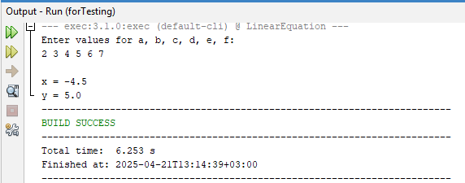
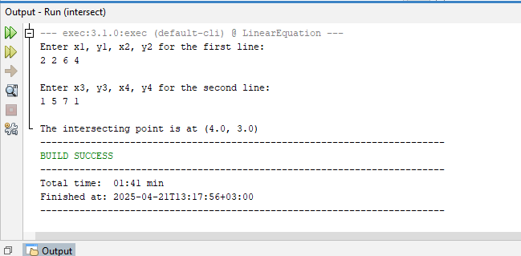
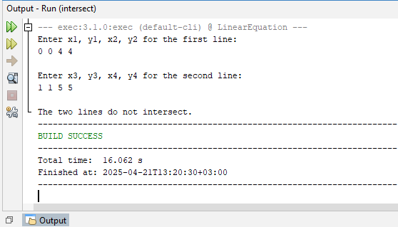
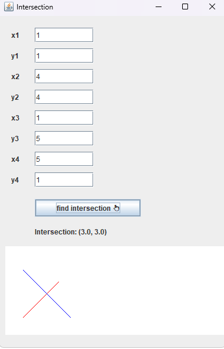

# Linear Equation Solver (Java)

This is a Programming II project that solves a system of two linear equations using Java. It includes:
- Console-based solution
- Intersection point calculator for two lines
- A GUI version made with Java Swing

## Features
- Checks if the system is solvable
- Calculates the intersection point
- GUI version for user-friendly input

## How to Run
1. Open the project in NetBeans or any Java IDE
2. Run `intersect.java` or `IntersectGUI.java`
3. Enter values as prompted or in the GUI

## Screenshots

### ✅ forTesting.java Output (Console version)

### ✅ intersect.java Output (Intersection Logic)

### ✅ IntersectGUI.java (Swing GUI version)

